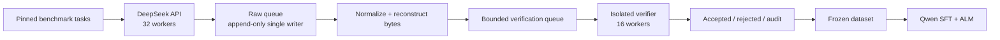

<div align="center">

# DeepSeek → Qwen Offline ALM Toolkit

**Verified coding data. Exact token traces. Auditable distillation.**

Build durable DeepSeek teacher datasets from public coding benchmarks, verify every
solution in isolation, and train Qwen students with byte-aligned Approximate
Likelihood Matching (ALM).

[English](README.md) · [简体中文](README.zh-CN.md)

[](pyproject.toml)
[](LICENSE)
[](docs/alm_implementation.md)
[](tests)

</div>

---

## What it does

This toolkit turns benchmark tasks into training-ready offline distillation records:

1. import pinned tasks from established coding datasets;
2. collect DeepSeek completions with actual-token bytes and log probabilities;
3. preserve raw and normalized attempts in append-only, resumable queues;
4. compile, import, and run official tests in isolated child processes;
5. freeze only trace-valid, format-valid, test-passing candidates;
6. train Qwen with hard SFT plus cross-tokenizer ALM.

The primary training objective is:

```text
total_loss = hard_sft_loss + alpha_alm * alm_loss
```

The repository contains no API keys, datasets, raw traces, models, adapters,
checkpoints, or experiment logs. It is a reusable research toolkit, not a hosted
service or a prepackaged model release.

## Why this toolkit

| Capability | What you get |
| --- | --- |
| Durable collection | Append-only JSONL, single-writer persistence, `fsync`, resume, attempt deduplication, durable errors, disk-watermark protection, and graceful stop. |
| Verified code data | Conservative source extraction, AST/interface checks, forbidden-operation checks, and separate compile/import/test phases. |
| Cross-tokenizer KD | O(T + S) byte-endpoint chunk alignment without requiring teacher and student token IDs to match. |
| Offline teacher traces | Training never needs a locally loaded teacher model; DeepSeek API traces are consumed through `OfflineTeacherTraceProvider`. |
| Comparable experiments | One Transformers/TRL entrypoint supports SFT-only and SFT+ALM, BF16 LoRA and BF16 full fine-tuning. |
| Auditable releases | Deterministic Hugging Face shards, allowlisted fields, manifest hashes, sensitive-data scans, and human-confirmed upload. |

## Pipeline



Official tests never enter the teacher prompt. Failed attempts remain available for
audit. If a completion is cleaned or rewritten, its old bytes/logprobs are no longer
authoritative and cannot be used for ALM.

## Supported surfaces

### Data sources

MBPP, APPS, CodeContests, TACO multi-shard, Open-R1 Codeforces, ODEX, and
xCodeEval importers are included. Each importer preserves source identity,
revision/split metadata, and tests separately from the teacher prompt.

### Trace profiles

| Profile | Published trace | Intended use |
| --- | --- | --- |
| `actual_only` | Completion text plus actual-token bytes/logprob | Primary ALM path; compact and recommended for large collection runs. |
| `strict_top20` | Actual trace plus exactly 20 candidate token/bytes/logprob rows per position and auditable tail mass | Optional strict top-20 + tail-bucket baseline; substantially larger. |

ALM is the primary objective. The strict top-20 path remains an experimental
baseline; this project does not substitute GOLD's ULD objective without proving
mathematical equivalence.

## Quick start

Python 3.12 is recommended. Python 3.11 is also supported.

```powershell
conda create -n deepseek-qwen-alm python=3.12 -y
conda activate deepseek-qwen-alm
python -m pip install -e ".[collect,archive,data,train,test]"
python -m pytest -q --basetemp=.pytest-tmp
```

Collection and verification do not require CUDA. For training, install the PyTorch
build appropriate for the target GPU image. A recent NVIDIA driver can run PyTorch
wheels that bundle an older CUDA runtime; the driver-reported CUDA version does not
need to match the wheel exactly.

## Run the 48-worker collector

The reference topology is 32 API workers feeding a durable raw single writer,
followed by streaming normalization and 16 isolated verifier workers.

Preview the full command graph first:

```powershell
python scripts/run_hard_collection_campaign.py `
  --config configs/collection.actual-only.48workers.example.json `
  --repo-root . `
  --python (Get-Command python).Source `
  --dry-run
```

Copy the example config and set a new `campaign_id`, `run_root`, source, limit,
seed, and exclusion list. Do not reuse the example run ID.

```powershell
$env:DEEPSEEK_API_KEY = "<your-key>"
powershell -ExecutionPolicy Bypass -File examples/collection_48workers/start_local.ps1 `
  -Config configs/my_campaign.json
```

Monitor or stop gracefully:

```powershell
powershell -ExecutionPolicy Bypass -File examples/collection_48workers/monitor_local.ps1 `
  -Config configs/my_campaign.json

powershell -ExecutionPolicy Bypass -File examples/collection_48workers/stop_local.ps1 `
  -Config configs/my_campaign.json
```

Graceful stop writes `STOP`, terminates the child process tree, and preserves every
already-synced raw, normalized, and verifier record. Restarting the same frozen
configuration skips completed IDs.

## Train a student

The authoritative entrypoint is [`examples/train_offline_alm.py`](examples/train_offline_alm.py).
It teacher-forces Qwen on the same completion and applies byte-aligned ALM chunks.

| Template | Mode | Objective |
| --- | --- | --- |
| [`training.sft-only.example.json`](configs/training.sft-only.example.json) | BF16 LoRA | `ALPHA_ALM=0.0` |
| [`training.sft-alm.example.json`](configs/training.sft-alm.example.json) | BF16 LoRA | `ALPHA_ALM=10.0` |
| [`training.qwen3-0.6b-full.example.json`](configs/training.qwen3-0.6b-full.example.json) | BF16 full fine-tuning | SFT-only and SFT+ALM pair; thinking disabled |

The LoRA templates do not 4-bit quantize the base model and are therefore not
mislabelled as QLoRA.

```bash
export TRAIN_DATASET=/path/to/frozen/training_records.jsonl
export STUDENT_MODEL=/path/to/pinned/qwen/snapshot
export OUTPUT_ROOT=/path/to/experiment

nohup bash examples/training/launch_pair.sh > "$OUTPUT_ROOT/launcher.log" 2>&1 &
bash examples/training/monitor_training.sh "$OUTPUT_ROOT"
```

Before training, audit the frozen data and the tokenizer/chat-template contract:

```bash
python scripts/audit_frozen_training_dataset.py --help
python scripts/audit_training_data_contract.py --help
```

These audits cover trace reconstruction, EOS supervision, sequence length, ALM
chunks, prompt/completion boundaries, and benchmark overlap. Qwen3 non-thinking
runs must pass `--chat-template-kwargs '{"enable_thinking": false}'` consistently
to audit and training code.

## Publish an audited dataset

The release CLI builds deterministic gzip shards using an explicit field allowlist.
It removes tests, verifier output, provider identifiers, local paths, and
credential-like values while preserving the selected trace contract.

```powershell
python scripts/release_hf_dataset.py package --help
python scripts/release_hf_dataset.py audit --help
python scripts/release_hf_dataset.py upload --help
```

Upload is a dry run unless `--execute` is supplied, and execution also requires the
exact human-reviewed manifest SHA256. See the complete procedure in
[`docs/huggingface_dataset_release.md`](docs/huggingface_dataset_release.md).

## Validation status

| Surface | Status |
| --- | --- |
| 48-worker `actual_only` collection and verification | Proven in end-to-end runs. |
| Qwen2.5 BF16 LoRA SFT/SFT+ALM launchers | Proven assets retained under [`proven_assets/`](proven_assets). |
| EvalPlus and LiveCodeBench harness | Proven snapshots retained for reproducible reuse. |
| Qwen3-0.6B full BF16 template | Data contract validated; GPU smoke is still required before treating it as proven. |
| Latest 4,500-attempt acceptance snapshot | 1,656 clean ALM candidates; 1,619 after exact problem-text deduplication. |

The Qwen3 contract snapshot supervised EOS on 1,656/1,656 examples and reported no
ALM preprocessing error, zero-chunk example, boundary drop, or sequence over 4096.
Details are recorded in
[`docs/data_acceptance_qwen3_0_6b_20260811.md`](docs/data_acceptance_qwen3_0_6b_20260811.md).

## Repository map

```text
src/deepseek_distill/   APIs, durable collection, verification, audits, ALM preprocessing
src/topk_distill/       ALM math/trainers and the strict top-20 experimental baseline
scripts/                Composable command-line workflows
examples/               Training entrypoints and operational launch/monitor templates
configs/                Secret-free collection and training examples
proven_assets/          Sanitized snapshots of launchers that completed real runs
tests/                  Fully offline fake-API and isolated-process tests
docs/                   Architecture, ADRs, source plans, contracts, and release guides
```

Start with:

- [Architecture](docs/architecture.md)
- [ALM implementation](docs/alm_implementation.md)
- [Standalone repository boundary](docs/decisions/006-standalone-repository-boundary.md)
- [Collection expansion design](docs/multisource_expansion_20k_v2.md)
- [Hugging Face release guide](docs/huggingface_dataset_release.md)
- [Asset provenance](ASSET_MANIFEST.md)

## Security boundaries

- API credentials are read from environment variables only.
- Automated tests never call a live API or download models/datasets.
- Generated code never executes in the collection process itself.
- Benchmark execution should run as a non-root Linux user with time, memory, and
  process limits plus a container/seccomp boundary where practical.
- `data/`, `outputs/`, `runs/`, model weights, checkpoints, logs, and `.env` files
  are ignored by default.
- Password-based deployment reads only `REMOTE_SSH_PASSWORD`; SSH keys and strict
  host-key verification are recommended for production use.

## License

Toolkit code is released under the [MIT License](LICENSE). Collected datasets retain
their own upstream licenses and provenance; a code license does not override source
dataset terms.
