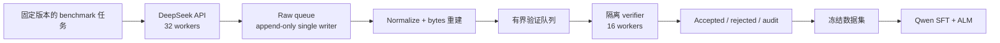

<div align="center">

# DeepSeek → Qwen Offline ALM Toolkit

**经过验证的代码数据、精确 token trace、可审计的模型蒸馏。**

从公开编程 benchmark 构建持久化 DeepSeek 教师数据，在隔离环境中验证每份
答案，并通过字节对齐的 Approximate Likelihood Matching（ALM）训练 Qwen。

[English](README.md) · [简体中文](README.zh-CN.md)

[](pyproject.toml)
[](LICENSE)
[](docs/alm_implementation.md)
[](tests)

</div>

---

## 它解决什么问题

这套工具链把 benchmark 题目转化为可直接训练、可复查的离线蒸馏记录：

1. 从固定 revision 的公开代码数据集导入任务；
2. 调用 DeepSeek，保存实际生成 token 的 bytes 与 logprob；
3. 用 append-only、可恢复的队列持久化 raw 与 normalized attempt；
4. 在隔离子进程中完成编译、导入和官方测试；
5. 只冻结 trace、格式和测试都通过的候选；
6. 用 hard SFT 与跨 tokenizer ALM 训练 Qwen。

主训练目标为：

```text
total_loss = hard_sft_loss + alpha_alm * alm_loss
```

仓库不包含 API key、数据集、原始 trace、模型、adapter、checkpoint 或实验日志。
它是一套可复用研究工具，不是托管服务，也不是预训练模型发布包。

## 核心能力

| 能力 | 提供的保证 |
| --- | --- |
| 持久化采集 | Append-only JSONL、single writer、`fsync`、断点恢复、attempt 去重、持久化错误、磁盘水位保护和优雅停止。 |
| 可验证代码数据 | 保守源码提取、AST/接口检查、禁止操作检查，以及分离的 compile/import/test 阶段。 |
| 跨 tokenizer 蒸馏 | O(T + S) 字节端点 chunk 对齐，不要求教师与学生 token ID 一致。 |
| 离线教师 trace | 训练时不加载本地教师模型，通过 `OfflineTeacherTraceProvider` 读取 DeepSeek API trace。 |
| 可比较实验 | 同一个 Transformers/TRL 入口支持 SFT-only、SFT+ALM、BF16 LoRA 与 BF16 全参训练。 |
| 可审计发布 | 确定性 Hugging Face shard、字段 allowlist、manifest 哈希、敏感信息扫描和人工确认上传。 |

## 数据流水线



官方测试永远不会进入 teacher prompt，所有失败尝试都会保留用于审计。如果修改
或清洗 completion，旧 bytes/logprobs 就不再对应新文本，不能继续用于 ALM。

## 支持范围

### 数据来源

内置 MBPP、APPS、CodeContests、TACO multi-shard、Open-R1 Codeforces、
ODEX 与 xCodeEval importer。每个 importer 都会保留来源 ID、revision/split
元数据，并把测试与教师 prompt 分离。

### Trace profile

| Profile | 保存内容 | 适用场景 |
| --- | --- | --- |
| `actual_only` | Completion 文本与实际 token bytes/logprob | ALM 主路径；体积小，适合大规模采集。 |
| `strict_top20` | 实际 trace，以及每位置恰好 20 个候选 token/bytes/logprob 和可审计 tail mass | 可选的 strict top-20 + tail-bucket 实验基线；体积显著更大。 |

ALM 是当前主目标。Strict top-20 仅作为实验基线保留；在没有证明数学目标等价前，
本项目不会直接用 GOLD 的 ULD objective 替换现有目标。

## 快速开始

推荐 Python 3.12，同时支持 Python 3.11。

```powershell
conda create -n deepseek-qwen-alm python=3.12 -y
conda activate deepseek-qwen-alm
python -m pip install -e ".[collect,archive,data,train,test]"
python -m pytest -q --basetemp=.pytest-tmp
```

采集与验证不需要 CUDA。训练时应安装与目标 GPU 镜像匹配的 PyTorch。驱动显示的
CUDA 版本不必与 wheel 完全相同；PyTorch wheel 自带 CUDA runtime，只需驱动足够新。

## 运行 48-worker 采集器

参考拓扑由 32 个 API worker、durable raw single writer、streaming normalizer
和 16 个隔离 verifier worker 组成。

先预览完整命令图：

```powershell
python scripts/run_hard_collection_campaign.py `
  --config configs/collection.actual-only.48workers.example.json `
  --repo-root . `
  --python (Get-Command python).Source `
  --dry-run
```

复制示例配置，为实际运行设置新的 `campaign_id`、`run_root`、数据源、limit、
seed 和排除列表，不要复用示例 run ID。

```powershell
$env:DEEPSEEK_API_KEY = "<your-key>"
powershell -ExecutionPolicy Bypass -File examples/collection_48workers/start_local.ps1 `
  -Config configs/my_campaign.json
```

监控与优雅停止：

```powershell
powershell -ExecutionPolicy Bypass -File examples/collection_48workers/monitor_local.ps1 `
  -Config configs/my_campaign.json

powershell -ExecutionPolicy Bypass -File examples/collection_48workers/stop_local.ps1 `
  -Config configs/my_campaign.json
```

优雅停止会写入 `STOP`、终止子进程树，并保留所有已经同步到磁盘的 raw、normalized
和 verifier 记录。用同一份冻结配置重启时，会跳过已完成 ID。

## 训练学生模型

权威入口是 [`examples/train_offline_alm.py`](examples/train_offline_alm.py)。它在
同一 completion 上对 Qwen 做 teacher forcing，并计算字节对齐的 ALM chunk。

| 模板 | 模式 | 目标 |
| --- | --- | --- |
| [`training.sft-only.example.json`](configs/training.sft-only.example.json) | BF16 LoRA | `ALPHA_ALM=0.0` |
| [`training.sft-alm.example.json`](configs/training.sft-alm.example.json) | BF16 LoRA | `ALPHA_ALM=10.0` |
| [`training.qwen3-0.6b-full.example.json`](configs/training.qwen3-0.6b-full.example.json) | BF16 全参训练 | SFT-only 与 SFT+ALM 对照；关闭 thinking |

LoRA 模板不会对基础模型做 4-bit 量化，因此这里没有把 BF16 LoRA 错称为 QLoRA。

```bash
export TRAIN_DATASET=/path/to/frozen/training_records.jsonl
export STUDENT_MODEL=/path/to/pinned/qwen/snapshot
export OUTPUT_ROOT=/path/to/experiment

nohup bash examples/training/launch_pair.sh > "$OUTPUT_ROOT/launcher.log" 2>&1 &
bash examples/training/monitor_training.sh "$OUTPUT_ROOT"
```

训练前先审计冻结数据与 tokenizer/chat-template 契约：

```bash
python scripts/audit_frozen_training_dataset.py --help
python scripts/audit_training_data_contract.py --help
```

审计覆盖 trace 重建、EOS supervision、序列长度、ALM chunk、prompt/completion
边界和 benchmark overlap。Qwen3 非思考模式必须在审计和训练中一致传入
`--chat-template-kwargs '{"enable_thinking": false}'`。

## 发布可审计数据集

发布 CLI 使用字段 allowlist 生成确定性 gzip shard。它会移除测试、verifier
输出、provider ID、本地路径和疑似凭据，同时保留所选 trace 契约。

```powershell
python scripts/release_hf_dataset.py package --help
python scripts/release_hf_dataset.py audit --help
python scripts/release_hf_dataset.py upload --help
```

默认 upload 只做 dry run；真正执行不仅需要 `--execute`，还必须提供人工审阅过的
manifest SHA256。完整流程见
[`docs/huggingface_dataset_release.md`](docs/huggingface_dataset_release.md)。

## 验证状态

| 模块 | 状态 |
| --- | --- |
| 48-worker `actual_only` 采集与验证 | 已完成端到端实跑。 |
| Qwen2.5 BF16 LoRA SFT/SFT+ALM 启动器 | 已跑通资产保存在 [`proven_assets/`](proven_assets)。 |
| EvalPlus 与 LiveCodeBench harness | 保留已跑通快照，可复用并追溯。 |
| Qwen3-0.6B BF16 全参模板 | 数据契约已验证；成为 proven asset 前仍需 GPU smoke。 |
| 最新 4,500-attempt 验收快照 | 1,656 条 clean ALM 候选；题面精确去重后 1,619 条。 |

Qwen3 契约快照中，1,656/1,656 条样本的 EOS 都参与监督，且 ALM preprocessing
error、zero chunk、boundary drop 与超过 4096 的样本均为 0。详情见
[`docs/data_acceptance_qwen3_0_6b_20260811.md`](docs/data_acceptance_qwen3_0_6b_20260811.md)。

## 仓库结构

```text
src/deepseek_distill/   API、持久化采集、验证、审计与 ALM 预处理
src/topk_distill/       ALM 数学/Trainer 与 strict top-20 实验基线
scripts/                可组合 CLI 工作流
examples/               训练入口、启动器与监控模板
configs/                不含密钥的采集和训练示例
proven_assets/          完成真实运行且已去敏的历史启动器快照
tests/                  完全离线的 fake-API 与隔离子进程测试
docs/                   架构、ADR、来源计划、数据契约与发布指南
```

推荐从以下文档开始：

- [架构](docs/architecture.md)
- [ALM 实现](docs/alm_implementation.md)
- [独立仓库边界 ADR](docs/decisions/006-standalone-repository-boundary.md)
- [多来源扩展设计](docs/multisource_expansion_20k_v2.md)
- [Hugging Face 发布指南](docs/huggingface_dataset_release.md)
- [资产来源清单](ASSET_MANIFEST.md)

## 安全边界

- API 凭据只从环境变量读取。
- 自动化测试不会调用 live API，也不会下载模型或数据。
- 生成代码不会在采集主进程中执行。
- Benchmark 应以 Linux 非 root 用户运行，并配置时间、内存、进程限制；条件允许时
  再增加容器/seccomp 边界。
- `data/`、`outputs/`、`runs/`、模型权重、checkpoint、日志和 `.env` 默认忽略。
- 密码部署只读取 `REMOTE_SSH_PASSWORD`；生产环境推荐 SSH key 与严格 host-key 校验。

## 许可证

工具代码采用 [MIT License](LICENSE)。采集数据仍服从各自上游许可证与 provenance；
代码许可证不会覆盖数据来源条款。
